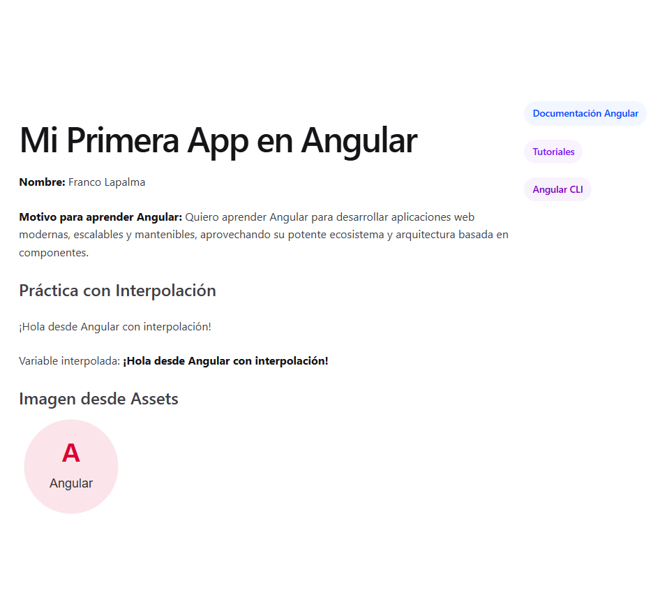

# Mi Primera App en Angular

## Descripción del Proyecto

Este proyecto es una aplicación Angular básica creada como parte del **Módulo 1 - Unidad 1: "Mi primera app en Angular"** del curso "Conociendo Angular". La aplicación demuestra los conceptos fundamentales de Angular incluyendo:

- Creación de un proyecto con Angular CLI
- Estructura de archivos y carpetas principales
- Componentes standalone (Angular 17+)
- Interpolación de datos en plantillas
- Uso de signals para reactividad
- Carga de assets (imágenes)

## Estructura del Proyecto

```
mi-primera-app-angular/
├── public/                 # Archivos estáticos públicos (favicon, etc.)
│   └── favicon.ico
├── src/
│   ├── assets/             # Carpeta assets para imágenes y recursos
│   │   └── angular-logo.svg    # Imagen agregada desde assets
│   ├── app/                # Código principal de la aplicación
│   │   ├── app.ts          # Componente principal (standalone)
│   │   ├── app.html        # Plantilla del componente
│   │   ├── app.css         # Estilos del componente
│   │   ├── app.config.ts   # Configuración de la aplicación
│   │   └── app.spec.ts     # Tests unitarios
│   ├── index.html          # HTML principal
│   ├── main.ts             # Punto de entrada (bootstrap)
│   └── styles.css          # Estilos globales
├── angular.json            # Configuración de Angular CLI
├── package.json            # Dependencias y scripts
└── README.md               # Este archivo
```

## Archivos Principales y su Función

| Archivo | Descripción |
|---------|-------------|
| `src/app/app.ts` | Componente principal standalone que define la lógica y datos reactivos (signals) |
| `src/app/app.html` | Plantilla HTML con interpolación (`{{ }}`) para mostrar datos dinámicos |
| `src/app/app.css` | Estilos CSS del componente principal |
| `src/app/app.config.ts` | Configuración de providers de la aplicación (error handlers, etc.) |
| `src/main.ts` | Punto de entrada que hace bootstrap de la aplicación |
| `src/index.html` | HTML base donde se monta el componente `<app-root>` |
| `public/` | Carpeta para archivos estáticos públicos (favicon.ico) |
| `src/assets/` | Carpeta para assets de la aplicación (imágenes, fuentes, etc.) |

## Instrucciones de Instalación y Ejecución

### Prerrequisitos
- Node.js (versión 18 o superior)
- npm (incluido con Node.js)
- Angular CLI (`npm install -g @angular/cli`)

### Pasos para ejecutar el proyecto

1. **Clonar el repositorio:**
   ```bash
   git clone <url-del-repositorio>
   cd mi-primera-app-angular
   ```

2. **Instalar dependencias:**
   ```bash
   npm install
   ```

3. **Ejecutar en modo desarrollo:**
   ```bash
   ng serve
   ```
   La aplicación estará disponible en `http://localhost:4200`

4. **Construir para producción:**
   ```bash
   ng build
   ```
   Los archivos de producción se generarán en `dist/mi-primera-app-angular/`

## Capturas de Pantalla


### Vista Principal de la Aplicación
La aplicación muestra:
- Título personalizado: "Mi Primera App en Angular"
- Información personal (nombre y motivo para aprender Angular)
- Sección de práctica con interpolación mostrando variables reactivas
- Imagen cargada desde la carpeta `src/assets/` (assets)
- Enlaces de referencia a documentación oficial

> **Nota:** Para ver la aplicación en funcionamiento, ejecuta `ng serve` y abre `http://localhost:4200` en tu navegador.

## Créditos del Autor

- **Nombre:** Franco Lapalma
- **Curso:** Desarrollo con Angular
- **Módulo:** 1 - Unidad 1: conociendo angular
- **Fecha:** Septiembre 2026

## Bibliografía y Fuentes

### Libros
- Freeman, A. *Pro Angular 9*. 6ª ed. Apress; 2020.

### Documentación Oficial
- Angular. (s.f.). **Welcome to the Angular tutorial**. https://angular.dev/tutorials/learn-angular
- Angular. (s.f.). **The Angular CLI**. https://angular.dev/tools/cli
- Angular. (s.f.). **Anatomy of a component**. https://angular.dev/guide/components

### Imágenes
- Logo Angular: Creado para este proyecto (SVG simple en `src/assets/angular-logo.svg`)

## Licencia

Este proyecto es solo para fines educativos como parte del curso "Conociendo Angular".